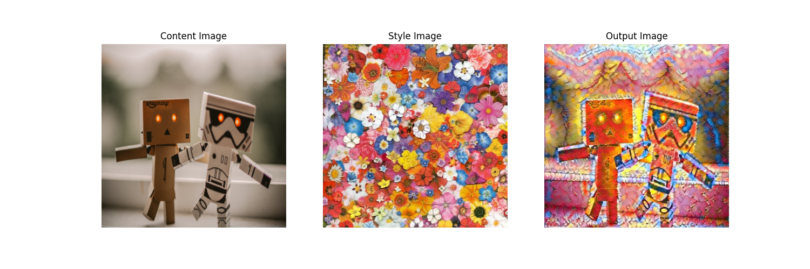
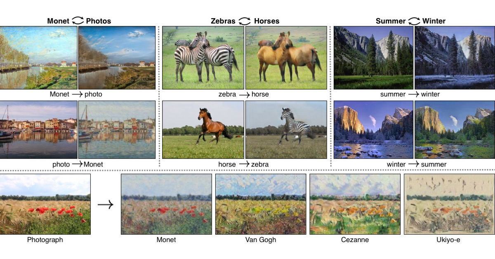
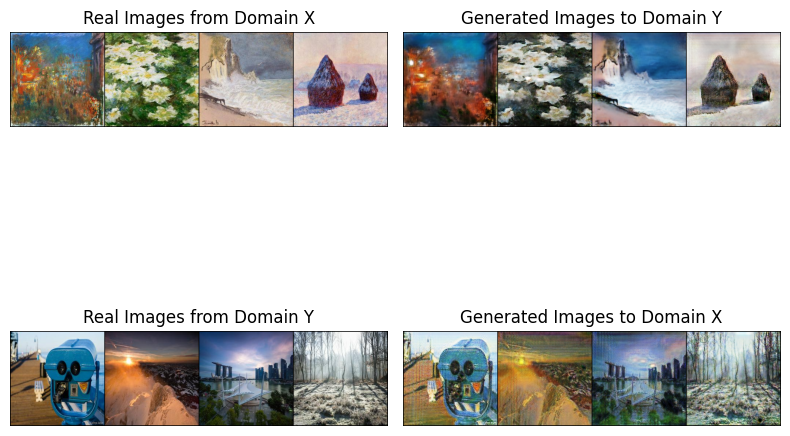

# Artistic Style Transfer

## Overview

 - This project implements Neural Style Transfer using the VGG19 convolutional neural network and introduces an additional approach using CycleGAN. Neural Style Transfer is a technique that combines the content of one image with the style of another, creating visually appealing and artistic results. 
 - In the CycleGAN approach, we leverage the power of Generative Adversarial Networks (GANs) to achieve artistic style transfer in a different way. The dataset used to train the GAN is [Monet2Photos](https://www.kaggle.com/competitions/gan-getting-started/data?select=photo_jpg)

## Neural Style Transfer with VGG19



## CycleGan




## Results

### Neural Style Transfer


### CycleGan



## Installation

1. Clone the repository:

   ```bash
   git clone https://github.com/nishantsinha00/Neural-Style-Transfer.git
   cd neural-style-transfer
2. Install Requirements 

    ``` bash
   pip install -r requirements.txt
